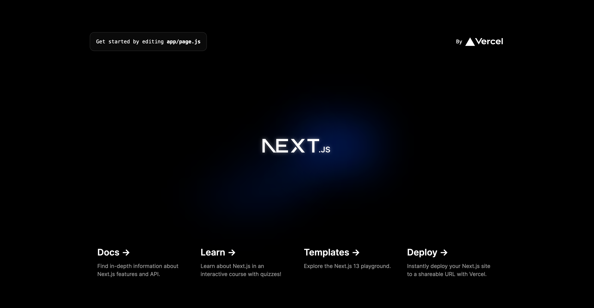
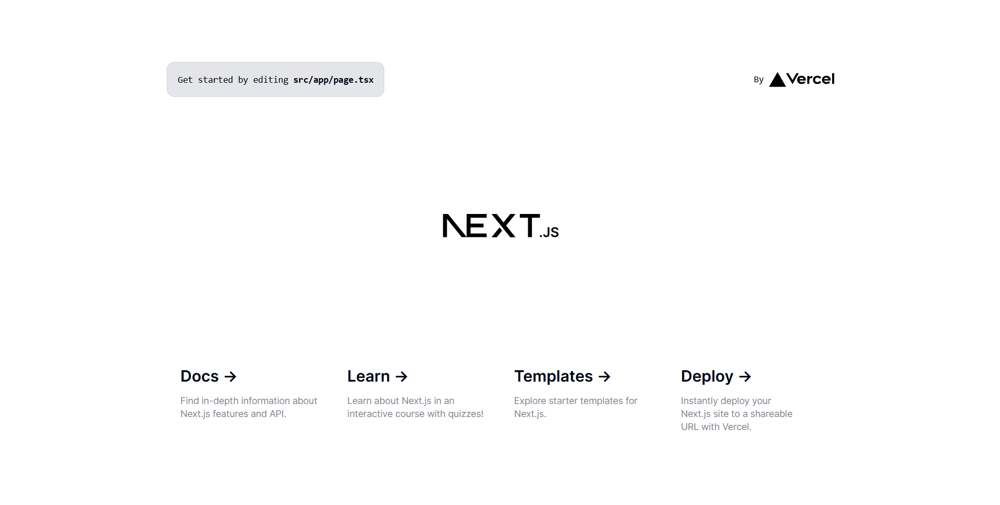
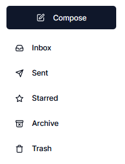

# playground
Using shadcn.ui components and Next.js, a playground for every possible full-stack app feature. 

## dev.log

### 7/26
installed nextjs

localhost:3000 looks like this

### 7/27
installed shadcn components

localhost:3000 looks like this

### 12/13

mail sidebar on /mail

